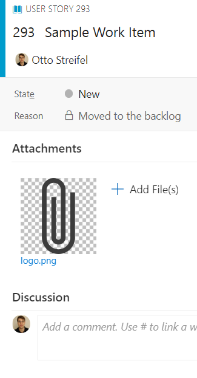
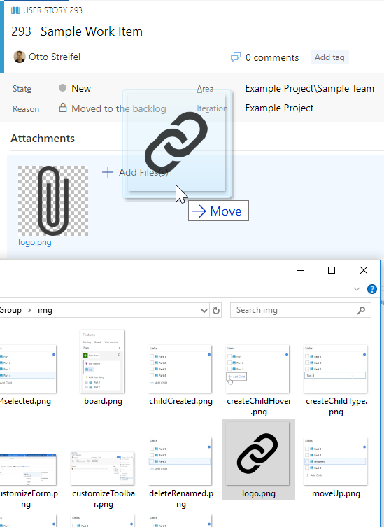
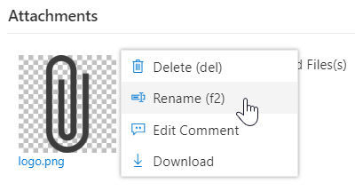
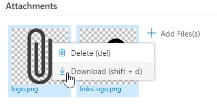
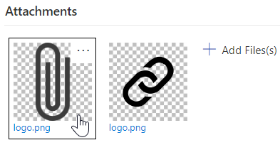
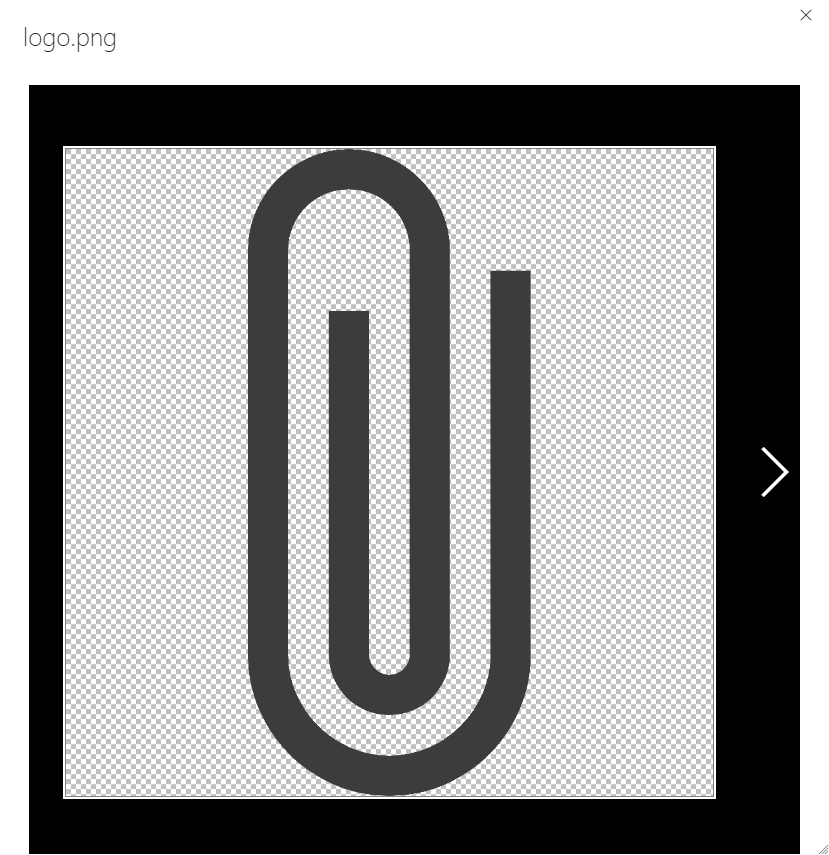
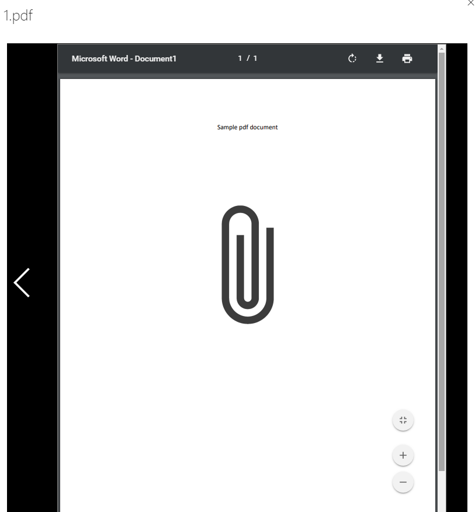
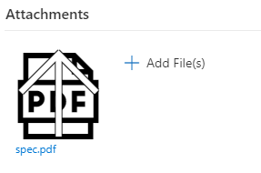
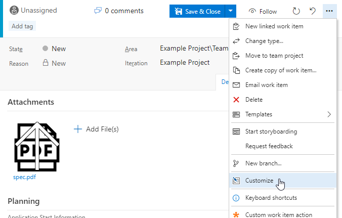

## Preview


## Drag and Drop
  
## Commands

## Bulk Commands
Shift/ctr click/arrow to select multiple files  

## Show fullsize
Double click tile or single click title to show preview  
This can also be done by pressing enter while the tile is focused.  
  
  
### Preview Pdfs
Supported in mozilla & chrome  


## File Icons
Common file types will show approriate icons to make them easier to find.


## Parent Attachments
Parent attachements will be shown with an up arrow overlay.


# Configuration with Visual Studio Team Services 

To configure where the board group is added click on the customize option from the work item form.  
  
Then drag the group where desired or hide it.  


# Configuration using process template

Navigate the process template xml.
For each work item type to customize at the location 
```xpath
/WITD/WORKITEMTYPE/FORM/WebLayout/Extensions
```
add 
```xml
<Extension Id="ottostreifel.attachments-group" />
```
Within the same Weblayout choose a Section element and add
```xml
<GroupContribution Label="Attachments" Id="ottostreifel.attachments-group.attachments-group"/>
```

# Change Log
(04/08/18) 1.2.1 bulk delete, bulk download, ctr + a select all
(04/07/18) 1.1.14 text preview, auxilary download button for files that would otherwise preview on click  
(04/07/18) 1.1.1 mp4 previews, change comments, rename files  
(04/06/18) 1.0.56 Pdf previews  
(04/04/18) 1.0.35 Show parent attachments  
(04/04/18) 1.0.27 Add more file icons  
(03/26/18) 1.0.1 Initial Release  
